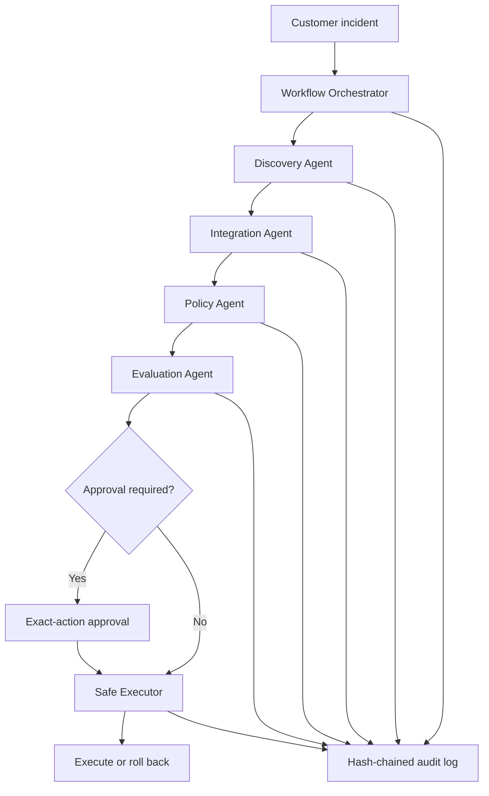

# CapabilityOS

A vendor-independent, safety-first multi-agent platform for enterprise incident response.

CapabilityOS demonstrates how Forward Deployed Engineers can translate an ambiguous customer problem into a governed, measurable, and auditable workflow without coupling the system to one AI model, cloud provider, or tool.

## Why CapabilityOS?

AI tools change quickly. Durable enterprise value comes from capabilities that remain useful when models and vendors change:

- Customer discovery and success criteria
- Vendor-independent integrations
- Role-based access controls
- Human approval for high-risk actions
- Exact-action authorization
- Automated evaluation
- Safe fallback and rollback
- Tamper-evident auditability

## Architecture



## Core Components

| Component | Responsibility |
| --- | --- |
| Discovery Agent | Converts an incident into constraints, risks, assumptions, and measurable success criteria |
| Integration Agent | Selects healthy provider adapters using capability, cost, latency, environment, and read-only requirements |
| Policy Agent | Enforces RBAC, data classification, redaction, and human-approval rules |
| Evaluation Agent | Scores safety, completeness, resilience, cost, latency, and production readiness |
| Workflow Orchestrator | Coordinates the complete workflow and fails closed at every stage |
| Approval Service | Creates expiring, single-use approvals bound to the exact proposed action |
| Safe Executor | Executes only verified actions and rolls back sealed partial failures |
| Audit Log | Stores sequential JSONL records protected by SHA-256 hash chaining |

## Safety Properties

CapabilityOS is designed to demonstrate:

- Production changes require explicit human approval.
- Requesters cannot approve their own actions.
- Approvals expire and can be used only once.
- Any change to an approved action invalidates the approval.
- Restricted data requires the appropriate security role.
- Unavailable providers are removed from routing.
- Missing capabilities block the workflow.
- Partial failures can trigger rollback.
- Audit-record modification is detectable.
- Invalid or incomplete requests fail closed.

## Example Incident

```text
Payment failures increased after a production deployment.
Checkout requests return HTTP 500.
Payment success dropped below 70%.

Goal:
Identify the likely cause and prepare a safe recovery plan.

Constraints:
- Preserve existing payment records.
- Do not interrupt unaffected customers.
- Do not modify production without human approval.
```

CapabilityOS converts this request into:

1. A structured problem definition
2. Risk and approval requirements
3. A vendor-independent integration plan
4. A policy decision
5. A production-readiness score
6. An exact-action approval
7. A safe execution or rollback outcome
8. A tamper-evident audit trail

## Installation

Requirements:

- Node.js 24+
- npm 11+

```bash
npm install
```

## Commands

```bash
npm run typecheck
npm test
npm run eval
npm run build
npm start
```

On Windows PowerShell, use `npm.cmd` if script execution policy blocks `npm.ps1`:

```powershell
npm.cmd run typecheck
npm.cmd test
npm.cmd run eval
npm.cmd run build
npm.cmd start
```

## Validation

Current validation includes:

- 28 automated tests
- 6 adversarial evaluation scenarios
- Provider outage and fallback routing
- Restricted-data access denial
- Approval replay prevention
- Exact-action mismatch detection
- Self-approval prevention
- Partial-failure rollback
- Audit tampering detection
- Invalid-request fail-closed behavior

## Project Structure

```text
capability-os/
├── evals/
│   └── run-evals.ts
├── src/
│   ├── adapters/
│   ├── agents/
│   ├── approval/
│   ├── audit/
│   ├── execution/
│   ├── orchestrator/
│   ├── types/
│   └── index.ts
├── tests/
├── .gitignore
├── package.json
├── tsconfig.json
└── README.md
```

## Design Decisions

### Capabilities over vendors

The Integration Agent selects adapters through a shared contract. The core workflow does not depend on a specific model, observability platform, or cloud provider.

### Deterministic safety controls

LLMs may eventually assist with discovery and analysis, but permissions, approvals, execution verification, audit integrity, and evaluation thresholds remain deterministic.

### Human authority over production changes

CapabilityOS may recommend a production action, but it cannot execute that action without a separate authorized human approving the exact proposal.

### Evaluation before execution

Safety, completeness, resilience, cost, latency, and fallback coverage are evaluated before a workflow can continue.

## Current Scope

CapabilityOS currently uses deterministic agents and synthetic adapters so its safety properties can be tested locally without production credentials.

Before real production deployment, the system would require:

- Durable approval storage
- Authenticated enterprise identities
- Secrets management
- Tenant isolation
- Real MCP and provider adapters
- Immutable external audit storage
- Distributed locking
- Monitoring and alerting
- Organization-specific policies

## Portfolio Value

This project demonstrates:

- Forward Deployed Engineering
- Enterprise agent architecture
- TypeScript and Node.js
- MCP-ready adapter design
- Multi-agent orchestration
- Human-in-the-loop systems
- RBAC and data governance
- Evaluation-driven development
- Failure recovery and rollback
- Secure software delivery

## Author

**Zee Marte**  
Full-Stack Engineer | Forward Deployed Engineer | Technical Product Manager

## License

MIT
